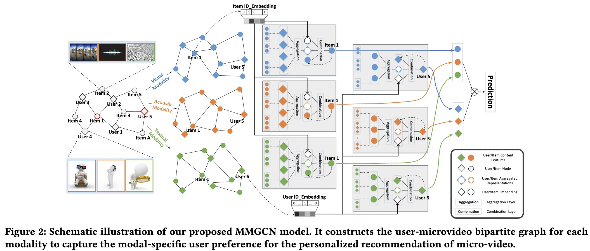

# MMGCN: Multi-modal Graph Convolution Network for Personalized Recommendation of Micro-video

> A novel multi-modal recommendation framework based on graph convolutional networks, explicitly modeling modal-specific user preferences to enhance micro-video recommendation.

## Authors

**Yinwei Wei**<sup>1</sup>, **Xiang Wang**<sup>2</sup>, **Liqiang Nie**<sup>1</sup>\*, **Xiangnan He**<sup>3</sup>, **Richang Hong**<sup>4</sup>, **Tat-Seng Chua**<sup>2</sup>

<sup>1</sup> Shandong University, China  
<sup>2</sup> National University of Singapore, Singapore  
<sup>3</sup> University of Science and Technology of China, China  
<sup>4</sup> Hefei University of Technology, China  
\* Corresponding author

## Table of Contents

- [Updates](#updates)
- [Introduction](#introduction)
- [Method / Framework](#method--framework)
- [Installation](#installation)
- [Dataset / Benchmark](#dataset--benchmark)
- [Usage](#usage)
- [License](#license)


---
## Links

\- **Paper**: [`ACM MM'19`](https://dl.acm.org/doi/10.1145/3343031.3351034)  
\- **Code Repository**: \[\`GitHub\`\](https://github.com/iLearn-Lab/MM19-MMGCN)

---

## Updates

\- \[10/2019\] Paper presented at ACM MM'19.  
\- \[01/2020\] Initial release of the PyTorch implementation and toy datasets.

---

## Introduction

This is the official PyTorch implementation for the paper **MMGCN: Multi-modal Graph Convolution Network for Personalized Recommendation of Micro-video**.

Multi-modal Graph Convolution Network is a novel multi-modal recommendation framework based on graph convolutional networks. It explicitly models modal-specific user preferences to enhance micro-video recommendation. In this repository, we provide the updated code and utilize a full-ranking strategy for both validation and testing.

---

## Method / Framework



---


## Installation

### **1\. Clone the repository**

`git clone \[https://github.com/iLearn-Lab/MM19-MMGCN.git\](https://github.com/iLearn-Lab/MM19-MMGCN.git)  `
`cd MM19-MMGCN`

### **2\. Environment Requirements**

The code has been tested running under **Python 3.5.2**. The required packages are as follows:

* Pytorch \== 1.1.0  
* torch-cluster \== 1.4.2  
* torch-geometric \== 1.2.1  
* torch-scatter \== 1.2.0  
* torch-sparse \== 0.4.0  
* numpy \== 1.16.0

Install the dependencies using pip:

`pip install torch==1.1.0 torchvision`
`pip install torch-scatter==1.2.0 torch-sparse==0.4.0 torch-cluster==1.4.2 torch-geometric==1.2.1  `
`pip install numpy==1.16.0`

---

## Dataset / Benchmark

We provide three processed datasets: Kwai, Tiktok, and Movielens.

Due to copyright restrictions, we cannot release the full datasets directly. You can find the full versions via their official sources: [Kwai](https://www.kuaishou.com/activity/uimc), [Tiktok](http://ai-lab-challenge.bytedance.com/tce/vc/), and [Movielens](https://grouplens.org/datasets/movielens/).

To facilitate this line of research, we provide some toy datasets:

* **BaiduPan**: [Download](https://pan.baidu.com/s/1BODXP7iihw8qtxpLeEv_XA) (Extraction code: zsye)  
* **GoogleDrive**: [Download](https://drive.google.com/file/d/1NoisyVDFWykTszSIbHdeoBrKn0t-D0ps/view?usp=sharing)

If you need the full datasets, please contact the respective data owners.

### Dataset Statistics

| Dataset | \#Interactions | \#Users | \#Items | Visual | Acoustic | Textual |
| :---- | :---- | :---- | :---- | :---- | :---- | :---- |
| Kwai | 1,664,305 | 22,611 | 329,510 | 2,048 | \- | 100 |
| Tiktok | 726,065 | 36,656 | 76,085 | 128 | 128 | 128 |
| Movielens | 1,239,508 | 55,485 | 5,986 | 2,048 | 128 | 100 |

### **File Descriptions**

* train.npy: Train file. Each line is a user with her/his positive interactions with items (userID and micro-video ID).  
* val.npy: Validation file. Each line is a user several positive interactions with items (userID and micro-video ID).  
* test.npy: Test file. Each line is a user with several positive interactions with items (userID and micro-video ID).

---

## Usage

The instruction of commands has been clearly stated in the codes. Run the following examples to train the models on different datasets.


Some important arguments:  


- `model_name`: 
  It specifies the type of model. Here we provide three options: 
  1. `MMGCN` (by default) proposed in MMGCN: Multi-modal Graph Convolution Network for Personalized Recommendation of Micro-video, ACM MM2019. Usage: `--model_name='MMGCN'`
  2. `VBPR` proposed in [VBPR: Visual Bayesian Personalized Ranking from Implicit Feedback](https://arxiv.org/abs/1510.01784), AAAI2016. Usage: `--model_name 'VBPR'`  
  3. `ACF` proposed in [Attentive Collaborative Filtering: Multimedia Recommendation with Item- and Component-Level Attention
](https://dl.acm.org/citation.cfm?id=3080797), SIGIR2017. Usage: `--model_name 'ACF'`  
  4. `GraphSAGE` proposed in [Inductive Representation Learning on Large Graphs](https://arxiv.org/abs/1706.02216), NIPS2017. Usage: `--model_name 'GraphSAGE'`
  5. `NGCF` proposed in [Neural Graph Collaborative Filtering](https://arxiv.org/abs/1905.08108), SIGIR2019. Usage: `--model_name 'NGCF'`  


- `aggr_mode` 
  It specifics the type of aggregation layer. Here we provide three options:  
  1. `mean` (by default) implements the mean aggregation in aggregation layer. Usage `--aggr_mode 'mean'`
  2. `max` implements the max aggregation in aggregation layer. Usage `--aggr_mode 'max'`
  3. `add` implements the sum aggregation in aggregation layer. Usage `--aggr_mode 'add'`
  
  
- `concat`:
  It indicates the type of combination layer. Here we provide two options:
  1. `concat`(by default) implements the concatenation combination in combination layer. Usage `--concat 'True'`
  2. `ele` implements the element-wise combination in combination layer. Usage `--concat 'False'`

-`train.npy`
   Train file. Each line is a user with her/his positive interactions with items: (userID and micro-video ID)  
-`val.npy`
   Validation file. Each line is a user several positive interactions with items: (userID and micro-video ID)  
-`test.npy`
   Test file. Each line is a user with several positive interactions with items: (userID and micro-video ID)  


---

**Acknowledgement**

The copyright for the program is owned by Shandong University.

---

## License

This program is licensed under the [GNU General Public License 3.0](https://www.gnu.org/licenses/gpl-3.0.html). Any derivative work obtained under this license must be licensed under the GNU General Public License as published by the Free Software Foundation, either Version 3 of the License, or (at your option) any later version, if this derivative work is distributed to a third party.

For commercial projects that require the ability to distribute the code of this program as part of a program that cannot be distributed under the GNU General Public License, please contact [weiyinwei@hotmail.com](mailto:weiyinwei@hotmail.com) to purchase a commercial license.

**Sources**  
1\. [https://github.com/Liuwq-bit/LightGT](https://github.com/Liuwq-bit/LightGT)  
2\. [https://github.com/Liuwq-bit/LightGT](https://github.com/Liuwq-bit/LightGT)  
3\. [https://github.com/weiyinwei/PHR\_GCN](https://github.com/weiyinwei/PHR_GCN)


## Citation

If you want to use our codes and datasets in your research, please cite:

``` 
@inproceedings{MMGCN,  
  title     \= {MMGCN: Multi-modal graph convolution network for personalized recommendation of micro-video},  
  author    \= {Wei, Yinwei and Wang, Xiang and Nie, Liqiang and He, Xiangnan and Hong, Richang and Chua, Tat-Seng},  
  booktitle \= {Proceedings of the 27th ACM International Conference on Multimedia},  
  pages     \= {1437--1445},  
  year      \= {2019}  
}
``` 
